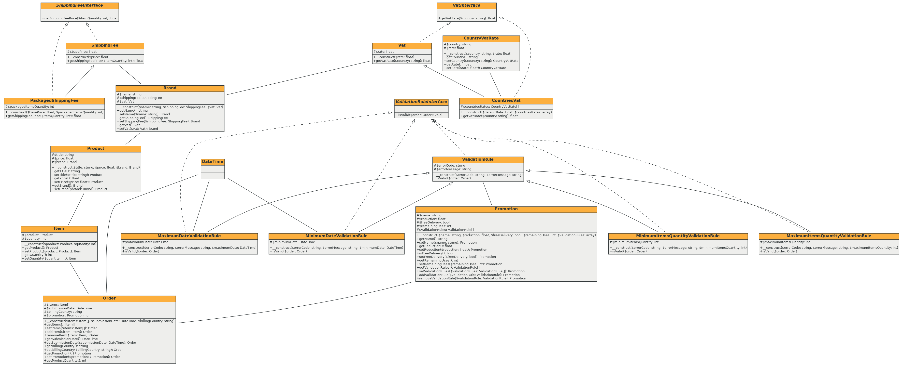

# TEST

Ceci est le repository pour le test technique de Farmitoo.

## Ma solution
Je n'ai pas implémenté de persistence des données, en espérant que ce ne soit pas requis. Je peux modifier si jamais c'est nécessaire.

Pour la prise ne compte du pays dans le calcul de la TVA, j'ai compris que le pays correspond au pays de réception. Il suffirait donc d'utiliser CountriesVat sur une marque pour indiquer le taux par pays. (en réalité je pense que le pays de réception ET celui d'envoi serait judicieux, il suffirait d'ajouter un attribut)

J'ai ajouté un report de la couverture de test (tests/coverage.txt). A noter que j'aurais pu effecter des TU pour tester les Exception des constructeurs d'entité même si dans l'idéal ces validations devraient être dans des service "validators" qui portent cette responsabilité.

J'ai tenté de montrer ma vision des choses, il y a des petits plus qui peuvent être mise en place mais qui ne sont peut⁻etre pas nécessaire pour ce contexte de test et qui demanderait un peu plus de temps (Symfony Translation, CI, DockerFile pour monter le projet directement en local).

#### Installation
`composer install`

`npm install`

`npm run build`

#### Conception

## Le cas

L'objectif est d'afficher une page "panier" sur laquelle sont visibles :
- tous les produits avec titre, prix unitaire, marque et quantité
- sous-total HT
- promotion (le cas échéant)
- frais de port HT
- total HT
- TVA
- Total TTC
- un bouton pour aller sur la page de paiement

#### Info TVA
Le business modèle de Farmitoo implique des règles de calculs de la TVA complexes.
Dans notre cas, il est simplifié et le taux de TVA dépend seulement de la marque du produit :
- Farmitoo => 20%
- Gallagher => 5%

#### Info frais de port
Les partenaires de Farmitoo ont des règles de calculs de frais de port très différentes. 
Voici celles de notre cas :
- Farmitoo : 20€ par tranche de 3 produits entamée (ex: 20€ pour 3 produits et 40€ pour 4 produits)
- Gallagher : 15€ quelque soit le nombre de produits

## L'évaluation
Il faut penser ton code comme évolutif :
- ajout de 10 nouvelles marques avec des nouvelles règles de calculs de TVA et de calculs de frais de port
- prise en compte du pays dans le calcul de la TVA
- nouvelles conditions d'application des promotions (nombre de produits, date, nombre d'utilisation...)

Au niveau global, sera évalué :
- la qualité du code
- la rigueur

#### Front
- L'UX
- L'organisation du code

#### Back
- Les choix de conception
- L'organisation du code

#### Test
L'objectif n'est pas un code coverage de 100% ! 
Mais un choix judicieux des choses à tester.
